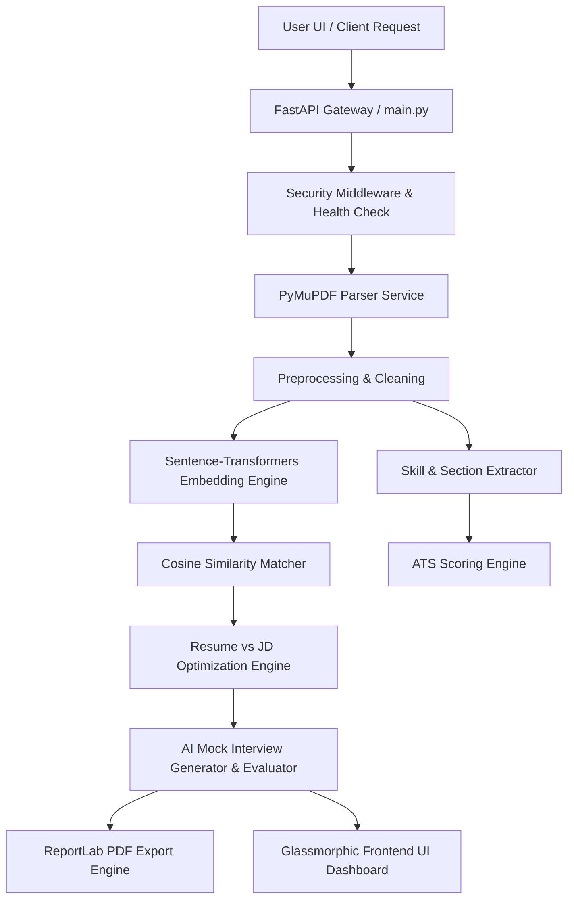

# 🚀 ResumeSphere AI — AI Resume Analyzer & Interactive Mock Interview Platform

[](https://www.python.org/)
[](https://fastapi.tiangolo.com/)
[](https://www.docker.com/)
[](.github/workflows/ci-cd.yml)
[](https://docs.pytest.org/)
[](https://mypy-lang.org/)
[](RELEASE_NOTES.md)
[](LICENSE)

**ResumeSphere AI** is an enterprise-grade AI Resume Analysis, ATS Optimization, Interactive Interview Preparation Platform, AI Marketplace, Global Talent Network, and Proactive AI Career Copilot. Built with a high-performance **FastAPI microservice architecture**, **Sentence-Transformers (384-dimensional dense semantic vector embeddings)**, and an **Interactive AI Interview Engine**, ResumeSphere AI empowers job seekers and recruiters to parse, score, optimize resumes, practice mock interviews in real time, monetize skills, build global professional relationships, and autonomously plan career growth.

---

## 📌 Features & Capabilities

- 📄 **PyMuPDF Resume Parsing**: C++ backed PDF text extraction (<15ms per document).
- 🧠 **Dense Vector Semantic Embedding**: `sentence-transformers/all-MiniLM-L6-v2` dense vector cosine matching.
- 📊 **Multi-Metric ATS Scoring**: Weighted score breakdown across formatting, keyword density, section structure, and quantified impact metrics.
- 🎯 **Recruiter Intelligence**: Automated candidate strengths, weaknesses, and hiring readiness index.
- ⚡ **Resume vs Job Description Matching**: Computes Overall Match %, ATS Match %, Semantic Match %, and Keyword Match %.
- 🎤 **Interactive AI Interview Platform (v3.0)**:
  - Technical, HR, Behavioral, Coding, and Managerial question generation.
  - Interactive timer (45s), progress bar, question navigation.
  - AI Answer Evaluation with score /10, strengths, weaknesses, and missing concepts.
  - Dynamic AI Follow-up question generation based on candidate answers.
  - Coding interview review with test cases & complexity analysis ($O(N)$ vs $O(N^2)$).
  - Interview Session History & Aggregated Performance Analytics.
  - Publication-grade PDF report download (`POST /api/interview/download-report`).
- 🛒 **AI Marketplace (v10.0.0)**:
  - Freelance Gig & Project marketplace for technical talent.
  - AI Recommended Gigs and Pricing Intelligence.
  - Mentorship Session Booking & Trust Scoring.
  - Payment Mock Architecture & Marketplace Analytics.
- 🌐 **Global Talent Network (v11.0.0)**:
  - Real-time Communication Hub using WebSockets.
  - AI Talent Graph & Team Matchmaker algorithms.
  - Professional Social Feed with achievements and project showcases.
  - Company Hubs, Event Registrations, and Network Reputation Scoring.
- 🤖 **AI Career Copilot (v12.0.0)**:
  - Multi-Agent AI System (Coordinator, Salary, Learning, Planning Agents).
  - Hands-Free Voice Assistant using native browser Speech APIs.
  - Proactive Skill Monitoring and Goal Planning.
  - Configurable Career Automations and Daily Planners.
- 🏢 **Enterprise SaaS Platform (v13.0.0)**:
  - Secure Multi-Tenant Architecture with Row-Level Isolation.
  - Enterprise Admin Console with Billing and API Key Management.
  - Organization White-labeling and Custom Branding.
  - Kubernetes-Ready Cloud-Native Deployment Manifests.
- 💻 **AI Operating System (v14.0.0)**:
  - Extensible App Ecosystem and Plugin Marketplace.
  - DAG-based Agent Orchestrator and Visual Workflow Engine.
  - Natural Language Business Intelligence (BI) Querying.
  - Serverless Custom Functions Sandbox architecture.
- 🚀 **Production & Enterprise Ready (v15.0.0)**:
  - Complete OWASP Top 10 Security Hardening.
  - Prometheus Observability & Metrics Exporting.
  - Comprehensive CI/CD Pipelines via GitHub Actions.
  - Advanced Disaster Recovery & RTO/RPO Planning.

---

## 🏗️ Architecture



---

## 💻 Quickstart & Setup

```bash
# Clone Repository
git clone https://github.com/SANJAYR0107/ResumeSphere-AI.git
cd ResumeSphere-AI

# Create & Activate Virtual Environment
python -m venv venv
source venv/bin/activate  # On Windows: .\venv\Scripts\Activate.ps1

# Install Dependencies
pip install -r requirements.txt

# Run Application
python -m uvicorn backend.main:app --host 127.0.0.1 --port 8000 --reload
```

App UI: `http://127.0.0.1:8000`  
Swagger OpenAPI Docs: `http://127.0.0.1:8000/docs`  
Health Check: `http://127.0.0.1:8000/health`

---

## 🐳 Docker Commands

```bash
# Run Container Stack
docker compose up -d --build

# Stop Stack
docker compose down
```

---

## 🧪 Testing & Verification

```bash
# Run 192 automated Pytest tests
pytest -v

# Run Mypy Strict Static Type Verification
mypy backend
```

---

## 📜 License

Distributed under the MIT License. See `LICENSE` for details.
