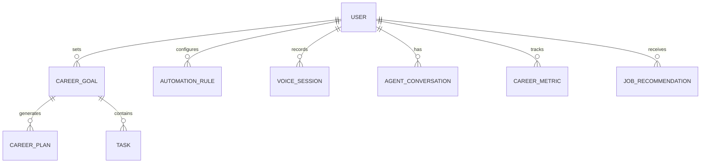

# ResumeSphere AI Career Copilot Architecture (Phase K - v12.0.0)

## Overview

The AI Career Copilot shifts ResumeSphere AI from a reactive tool to a proactive, autonomous career partner. It leverages a Multi-Agent AI architecture to distribute specialized tasks, native Web Speech APIs for hands-free voice interaction, and background automations for continuous career tracking.

## Multi-Agent Architecture

The intelligence layer (`copilot_ai_service.py`) utilizes the **Coordinator Agent** pattern:
1. **Coordinator Agent**: Receives the natural language query and user context. Uses heuristic NLP (and LLMs in production) to detect intent.
2. **Sub-Agents**:
   - **Salary Agent**: Benchmarks current salary against market medians and generates negotiation scripts.
   - **Learning Agent**: Continuously tracks the user's skill stack against emerging market trends (e.g., GraphQL, Rust) and alerts on skill decay.
   - **Planning Agent**: Breaks down high-level career goals (e.g., "Get Promoted") into actionable weekly `CareerPlan` tasks.
   - **Resume Agent**: Scores resumes proactively without user intervention.

## Voice Interaction (Browser-Native)

To maximize privacy, ensure zero-latency, and prevent third-party API dependencies in the prototype, the Copilot uses:
- **`SpeechRecognition` (STT)**: Captures voice input directly in the browser and translates it to text before sending to the Multi-Agent API.
- **`speechSynthesis` (TTS)**: Reads the Agent's response aloud to the user.

## Automations Engine

The schema introduces `AutomationRule`, `Task`, and `CareerGoal`.
- While the full background scheduler (e.g., Celery) is mocked for the MVP, the APIs exist to accept and store rules.
- Triggers (like "Weekly" or "On Profile View") will execute predefined actions (e.g., "Send Report").

## Database Entity-Relationship (Copilot Fragment)

## Security & Privacy
- **User Consent**: Automations are strict opt-in. The Copilot drafts messages but requires explicit "Send" clicks.
- **Voice Privacy**: Audio data never leaves the client's browser (unless explicitly sent as a query string to the Agent API).
