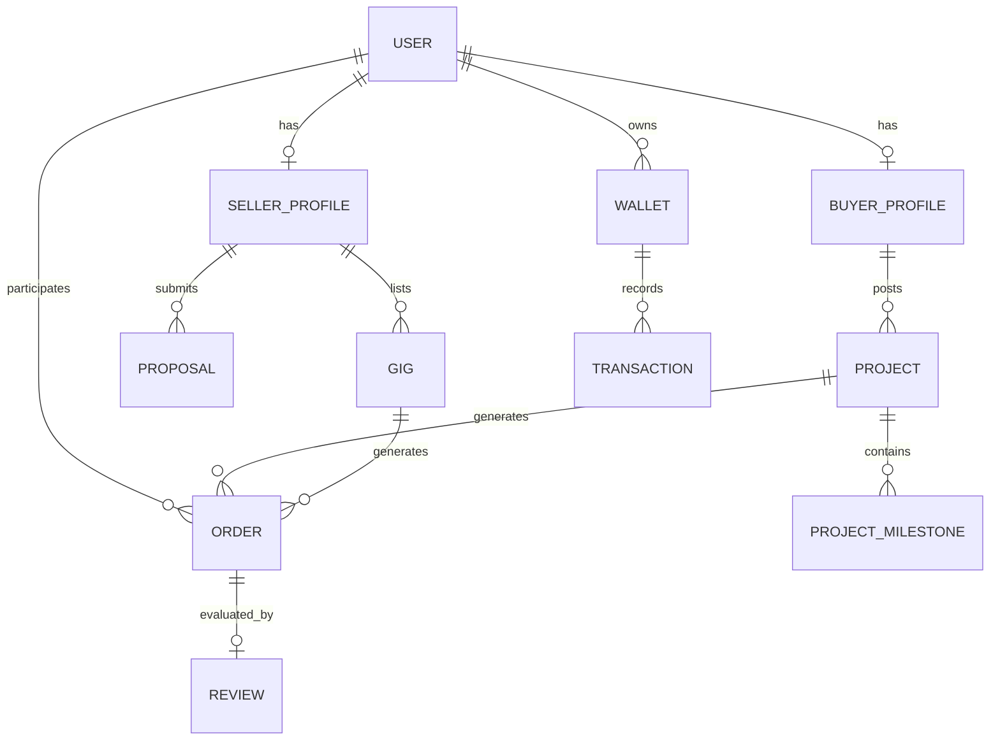

# ResumeSphere AI Marketplace Architecture (Phase I - v10.0.0)

## Overview

The AI Marketplace transforms ResumeSphere AI into a full-fledged talent and service exchange ecosystem. It connects buyers, sellers, mentors, and mentees through intelligent matching algorithms.

## Key Modules

### 1. Freelancer & Project Marketplace
- **Profiles**: Segregated `SellerProfile` and `BuyerProfile` linked to core `User` model.
- **Gigs**: Fixed-price service listings (`Gig`) with categories and dynamic AI-suggested pricing.
- **Projects**: Custom buyer requests (`Project`) requiring tailored proposals (`Proposal`).

### 2. Payment & Order Architecture
- **Orders**: A unified `Order` model representing the lifecycle of gig purchases or project milestones.
- **Wallets & Transactions**: Mocked abstraction for future Stripe/PayPal integration. 
- **Analytics**: Global reporting via `MarketplaceAnalytics` for sales trends and volume.

### 3. Trust & Quality Engine
- **Reviews**: Bidirectional rating system tied to completed orders.
- **AI Trust Score**: A dynamic score from 0-100 factoring in completed orders, rating averages, and account age.
- **Fraud Detection**: AI hooks evaluate transaction amount, device novelty, and trust score to flag risky behavior.

## AI Services Layer (`marketplace_ai_service.py`)

- **Gig Recommendation**: Matches candidates' skills (`SkillExtractorService`) to active gigs using semantic overlap and randomized discovery indexing.
- **Project Matching**: Links freelancer skillsets to required project competencies.
- **Pricing Intelligence**: Outputs `min_rate`, `suggested_hourly_rate`, and `max_rate` based on category multipliers and experience brackets.
- **Demand Forecasting**: Analyzes gig category throughput to predict market trends.

## Database Entity-Relationship (Key Models)

## Deployment
Marketplace components are 100% backward compatible and deploy via the standard `docker-compose up --build`. No breaking changes to existing endpoints.
