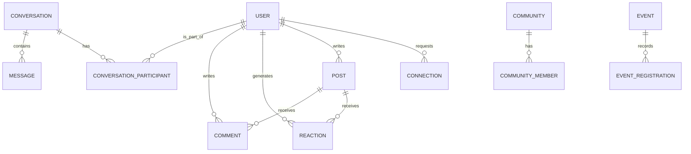

# ResumeSphere AI Global Talent Network Architecture (Phase J - v11.0.0)

## Overview

The Global Talent Network transforms ResumeSphere AI into a fully interconnected professional ecosystem, introducing real-time communication, social feeds, and an AI-powered semantic graph.

## Key Modules

### 1. Real-time Communication (WebSockets)
- **FastAPI WebSockets**: Implemented in `routes_network.py` using `WebSocketDisconnect`.
- **In-Memory Connection Manager**: Handles `connect()`, `disconnect()`, `send_personal_message()`, and `broadcast()`. (Designed for MVP scalability, ready to be replaced with Redis Pub/Sub in multi-worker environments).
- **Security**: Upgraded to handle persistent connections, maintaining state per `user_id`.

### 2. Professional Social Feed
- **REST APIs**: `POST /api/network/posts` and `GET /api/network/feed`.
- **Engagement**: Users can like, comment, and share. Activity triggers updates to the user's `Influence Score`.

### 3. AI Matchmaker & Network Intelligence (`network_ai_service.py`)
- **Connection Recommendations**: Calculates skill overlap using symmetric difference and heuristically adds discovery noise.
- **Team Formation**: Identifies complementary skill sets among available users to fulfill project requirements (e.g., Hackathons).
- **Influence Score**: A rolling metric bounded to 100, evaluating network depth (connections), breadth (posting volume), and engagement (reactions).

## Database Entity-Relationship (Graph Abstraction)

## Deployment
WebSockets operate on the standard HTTP port (typically `8000`), automatically handled by the ASGI server (`uvicorn` or `gunicorn` with worker-class). Docker configurations require zero changes as ASGI is natively supported by our Phase A DevOps foundation.
