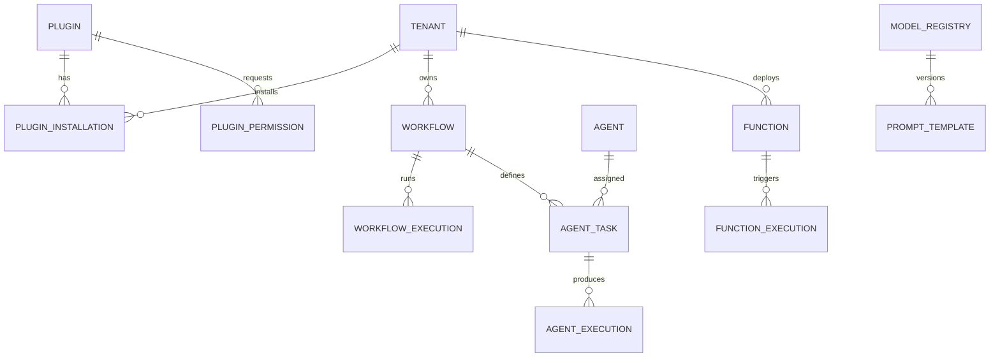

# ResumeSphere AI Platform OS Architecture (Phase M - v14.0.0)

## Overview

The Platform OS transforms ResumeSphere AI into an extensible ecosystem. It allows third-party developers to build micro-apps, allows administrators to define visual Agentic Workflows, provides a mocked sandbox for custom functions, and integrates a Natural Language Business Intelligence (BI) engine.

## App Ecosystem (Plugin Architecture)

Third-party integrations are managed via the `Plugin` and `PluginInstallation` schemas:
- **Registry**: `POST /api/platform/plugins` accepts a JSON manifest detailing the plugin's hooks.
- **Tenant Isolation**: A plugin must be "Installed" into a specific `tenant_id` to activate its webhooks or UI injections.
- **Permissions**: `PluginPermission` restricts what parts of the core database a plugin can access via OAuth2-style scopes (e.g., `read:resume`).

## Agent Orchestrator & Workflows

Instead of hardcoded Python scripts, business logic can now be represented as Directed Acyclic Graphs (DAGs):
1. **Definition**: `Workflow.definition` stores the DAG in JSON format.
2. **Execution Engine**: `platform_ai_service.orchestrate_workflow` parses the DAG, identifies parallelizable nodes (e.g., Parsing and Scoring simultaneously), and dispatches them to specialized Sub-Agents.
3. **Execution Logs**: `AgentExecution` records latency and output for every node.

## Custom Functions (Serverless Sandbox)

To support complete enterprise extensibility, we introduced a `Function` registry. 
*Note: In this MVP iteration, `POST /api/platform/functions/run` strictly MOCKS execution to prevent arbitrary code execution vulnerabilities. In a production cluster, this endpoint would forward the `code` payload to an isolated WebAssembly (Wasm) runtime (e.g., using Extism) or a Firecracker MicroVM.*

## Business Intelligence (BI)

The Platform OS includes a built-in Data Warehouse interface:
- **NL2SQL**: `platform_ai_service.generate_sql_from_nl` utilizes semantic matching to translate natural language (e.g., "What is our revenue?") into executable SQL queries against the underlying PostgreSQL database.

## Database Entity-Relationship (Platform Fragment)

