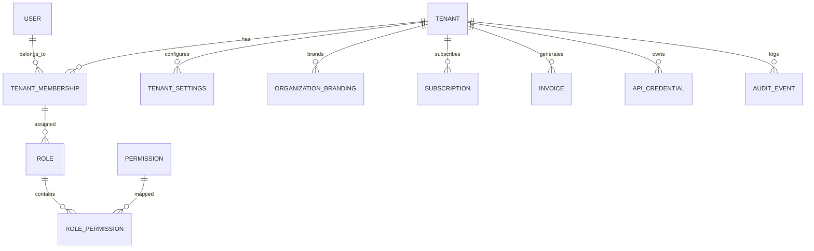

# ResumeSphere Enterprise SaaS Architecture (Phase L - v13.0.0)

## Overview

The Enterprise SaaS Platform transforms ResumeSphere AI from a single-tenant application into a multi-tenant enterprise solution ready for Kubernetes deployment. This architecture allows Universities, Staffing Agencies, and Large Corporations to provision isolated workspaces.

## Multi-Tenant Strategy

We employ a **Logical Multi-Tenancy (Row-Level Isolation)** model:
1. Every SaaS resource (Subscriptions, API Keys, Audit Logs) holds a `tenant_id` foreign key.
2. We introduced a `TenantMembership` junction table to bridge existing global `User` models to isolated `Tenant` workspaces. This guarantees 100% backward compatibility for existing users while supporting new organizational deployments.
3. FastAPI Endpoints use a `get_tenant_id` dependency (middleware) that strictly enforces the presence of the `X-Tenant-ID` header for all `/api/saas/*` requests.

## Identity & SSO

The `TenantSettings` model acts as the configuration hub for Enterprise SSO:
- Stores Identity Provider (IdP) metadata for SAML 2.0 or OIDC.
- Allows integration with Okta, Azure AD, or Google Workspace via external authentication handlers (to be connected in production).

## Enterprise Administration

The **Enterprise Admin Console** (`saas-dashboard.html`) provides HR Admins and Super Admins with:
- **Billing & Subscriptions**: Mock Stripe implementations tracking AI credits usage (`UsageRecord`).
- **API Management**: Generation of tenant-scoped API keys (`ApiCredential`) with hash-only database storage.
- **Organization Branding**: Custom logo and CSS storage for white-labeling.

## Kubernetes Deployment Strategy

The application is now Cloud-Native:
- **`kubernetes/deployment.yaml`** includes standard K8s primitives:
  - `ConfigMap` for centralized environment injection.
  - `Deployment` (replicas: 3) with defined CPU/Memory constraints.
  - `LivenessProbes` targeting the FastAPI `/api/health` check.
  - `Service` & `Ingress` for traffic routing.

## Database Entity-Relationship (SaaS Fragment)

